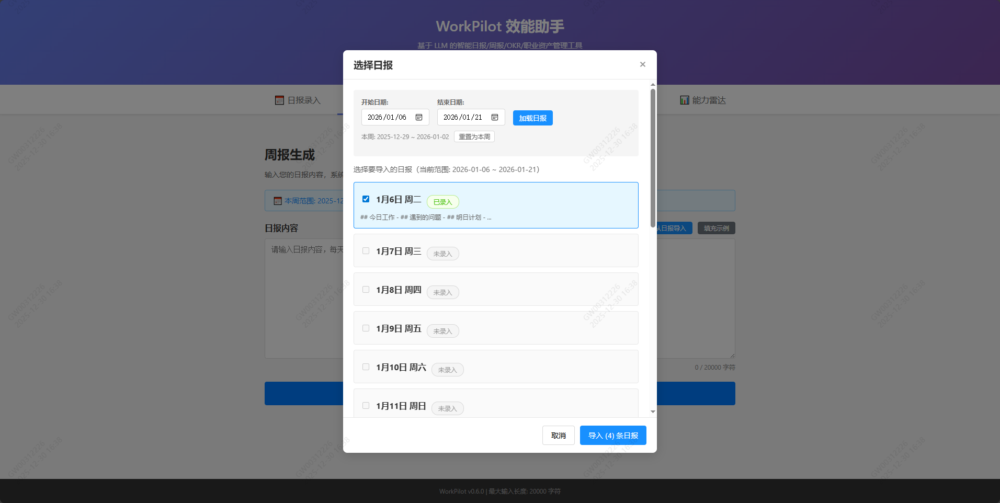
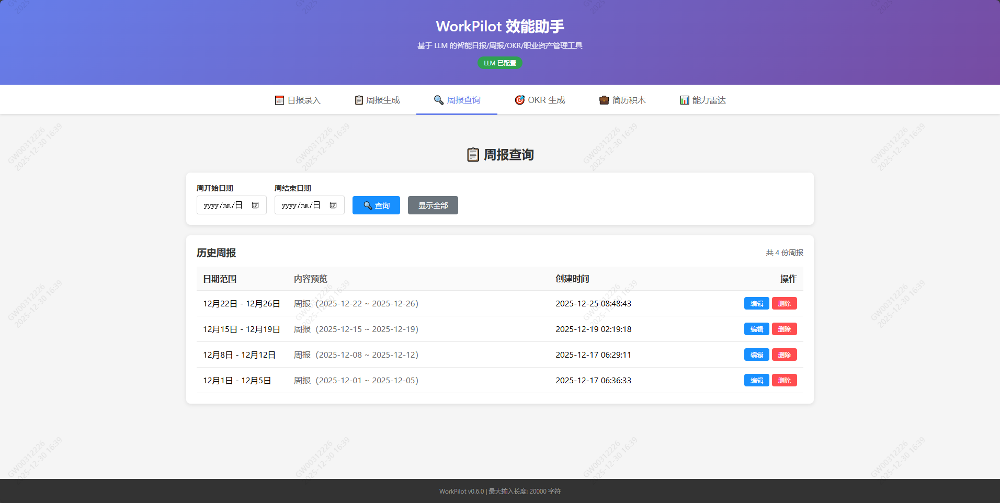
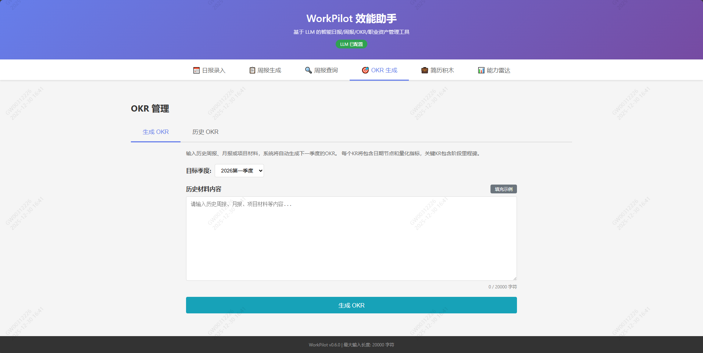
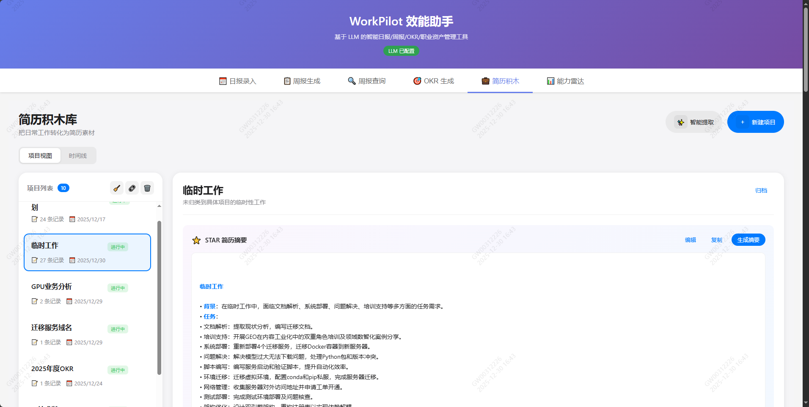
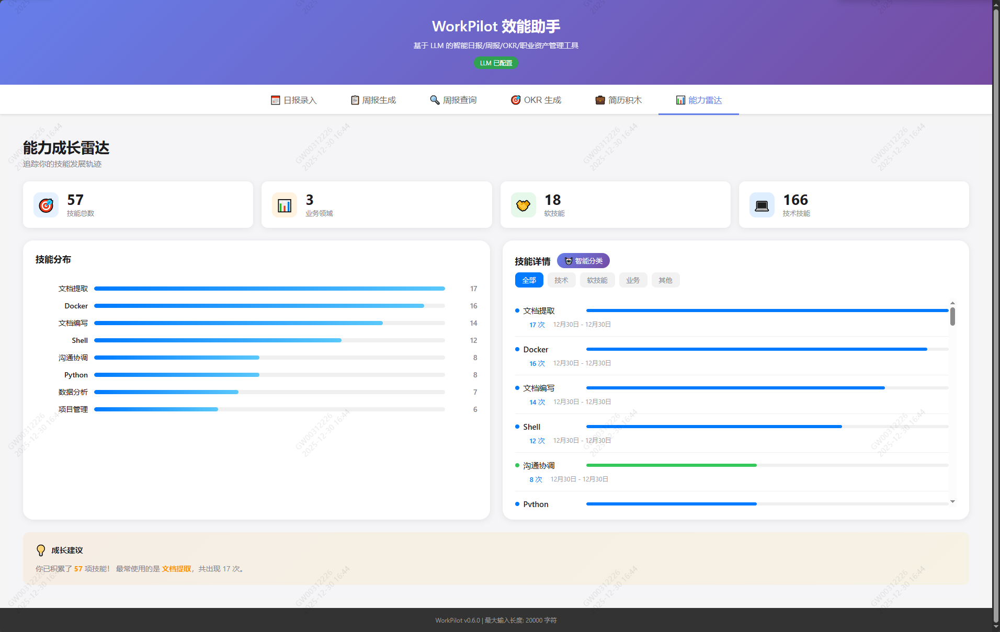

# WorkPilot 效能助手

中文文档 | [English](README.md)

一个基于 AI 大模型的智能工作效能助手，专为提升职场效率而设计。通过日报积累、周报智能生成、OKR 目标管理、职业资产沉淀和能力雷达分析六大核心功能，帮助您告别繁琐的文档整理工作，让报告撰写和职业发展规划变得简单高效。

**核心价值：**
- 📝 **日报管理**：日历式日报录入，支持节假日显示，内置 TODO 提醒面板
- 🤖 **智能周报**：一键从日报生成规范周报，自动分类归纳、去重合并、提取风险点
- 🎯 **OKR 规划**：基于历史材料智能生成季度 OKR，包含量化指标和里程碑节点
- 💼 **简历积木**：自动提取 STAR 格式工作成果，积累职业资产
- 📊 **能力雷达**：技能成长追踪，AI 智能分类，可视化能力分布
- 📤 **多格式导出**：支持导出为 CSV、Markdown、TXT 格式
- 💾 **本地存储**：所有数据存储在本地 SQLite 数据库，安全可靠
- 🚀 **一键部署**：支持 Docker 或本地部署，Windows 用户可使用批处理脚本一键启动

## 📷 产品展示

### 日报录入界面

*日历视图 + 节假日显示 + TODO Tips 记事板 + 快捷模板 + 多格式导出*

### 周报生成界面

*从日报导入 + 智能分类 + 风险分析*

### 周报查询界面

*历史查询 + 编辑删除 + 多格式导出*

### OKR 管理界面

*智能生成 + 量化指标 + 里程碑规划 + 多格式导出*

### 简历积木界面

*STAR 格式提取 + 项目时间线 + 职业资产管理*

### 能力雷达界面

*技能分布可视化 + AI 智能分类 + 技能详情查看*

> 💡 **提示**：如需添加截图，请将图片文件放置在 `screenshots/` 目录下。详见 [screenshots/README.md](./screenshots/README.md)

## 📋 功能特性

### 📅 日报录入
- **日历视图**：大日历界面，点击日期直接录入日报
- **节假日显示**：日历中显示中国传统节日和国际节日（春节、中秋、国庆、圣诞等）
- **周末标识**：周六周日红色字体显示
- **数据持久化**：日报自动保存到本地 SQLite 数据库
- **快捷模板**：支持插入日报模板，快速填写
- **状态标识**：已录入日期绿色标记，一目了然
- **统计功能**：显示本月和总计录入数量
- **TODO Tips**：左侧悬浮记事板，可添加/勾选/删除 TODO 项
- **多格式导出**：支持导出当前日报或全部日报为 CSV/Markdown/TXT 格式

### 📋 周报生成
- **自动周报生成**：从文本日报（单天或整周拼接）生成固定结构的周报邮件正文
- **从日报导入**：一键选择已录入的日报，支持自定义日期范围（可选历史日报）
- **灵活日期范围**：生成周报时使用实际导入的日期范围，而非固定本周范围
- **智能日期识别**：自动识别日期格式（`20251212 8h` 或 `2025-12-12 8h`）
- **智能分类**：自动归类手上项目、服务化能力建设、预研、其他事务性工作
- **去重合并**：自动去重合并相似条目
- **风险分析**：风险点提取与应对建议
- **保存周报**：生成的周报可保存到数据库

### 🔍 周报查询
- **历史查询**：按日期范围查询历史周报
- **编辑功能**：可编辑已保存的周报
- **删除功能**：可删除不需要的周报记录
- **多格式导出**：支持导出为 CSV/Markdown/TXT 格式

### 🎯 OKR 管理
- **智能 OKR 生成**：结合历史材料生成下一季度 OKR
- **明确时间节点**：每个 KR 包含明确日期节点（`YYYY-MM-DD前`）
- **量化指标**：每个 KR 包含量化表达（阈值/比例/数量等）
- **里程碑规划**：关键 KR 包含阶段里程碑（M1/M2/M3）
- **目标管理**：生成 2-3 个合理目标
- **保存 OKR**：生成的 OKR 可保存到数据库
- **多格式导出**：支持导出为 CSV/Markdown/TXT 格式

### � 简历积木（职业资产管理）
- **STAR 格式提取**：从日报/周报中智能提取 Situation-Task-Action-Result 格式的工作成果
- **项目归类**：自动识别和归类项目
- **时间线视图**：按时间顺序展示职业成果
- **成果编辑**：支持编辑 STAR 摘要，完善职业资产
- **数据清理**：支持合并相似项目、清理无效数据

### 📊 能力雷达
- **技能分布可视化**：雷达图展示技能使用频率
- **AI 智能分类**：使用 LLM 智能识别技能类别（技术技能/软技能/业务领域）
- **分类筛选**：按技能类别筛选查看
- **技能详情**：点击技能查看相关工作条目
- **成长追踪**：记录技能首次使用和最近使用时间

### �💾 数据存储
- 使用 SQLite 轻量级数据库
- 数据文件位置：`backend/data/reports.db`
- 数据表：日报、周报、OKR、TODO、工作项、项目、技能等

## 🛠️ 技术栈

- **前端**: React + TypeScript
- **后端**: Flask + Python
- **LLM**: OpenAI-like chat completions API
- **部署**: Docker / 本地 / 批处理脚本

## 🚀 快速开始

### 方式一：一键启动脚本（推荐 Windows 用户）⭐

**Windows 用户最简单的方式：**

1. 克隆项目并安装依赖
```bash
git clone https://github.com/steven140811/WorkPilot.git
cd WorkPilot

# 安装后端依赖
cd backend
pip install -r requirements.txt

# 安装前端依赖
cd ../frontend
npm install
cd ..
```

2. 配置环境变量
```bash
# 编辑 backend\.env 文件，填入 LLM API 配置
# 如果不配置，将使用模拟模式
```

3. 一键启动所有服务
```bash
# 双击运行或在命令行执行
start_services.bat

# 停止服务
stop_services.bat
```

**特性：**
- ✅ 自动检测并释放端口冲突
- ✅ 后端使用 `pythonw.exe` 完全后台运行（无窗口）
- ✅ 前端后台运行
- ✅ 自动打开浏览器
- ✅ 日志输出到文件：`backend\backend.log` 和 `frontend\frontend.log`
- ✅ 启动脚本退出后服务继续运行

4. 访问应用
- 前端: http://localhost:5002
- 后端 API: http://localhost:5001

### 方式二：Docker 部署

```bash
# 构建 Docker 镜像
docker-compose up -d

# 访问应用
# 前端: http://localhost:3000
# 后端 API: http://localhost:5000
```

### 方式三：手动部署

#### 后端

```bash
cd backend
pip install -r requirements.txt
python app.py
```

#### 前端

```bash
cd frontend
npm install
npm start
```

## 📁 项目结构

```
WorkPilot/
├── backend/                 # 后端 Flask 应用
│   ├── app.py              # 主应用入口
│   ├── config.py           # 配置管理
│   ├── generator.py        # 报告生成逻辑
│   ├── llm_client.py       # LLM 客户端
│   ├── parser.py           # 文本解析器
│   ├── prompts.py          # AI 提示词模板
│   ├── database.py         # SQLite 数据库模块
│   ├── requirements.txt    # Python 依赖
│   ├── data/               # 数据目录
│   │   └── reports.db      # SQLite 数据库文件
│   └── tests/              # 测试文件
├── frontend/               # 前端 React 应用
│   ├── src/
│   │   ├── components/
│   │   │   ├── DailyReportEntry.tsx      # 日报录入组件
│   │   │   ├── WeeklyReportGenerator.tsx # 周报生成组件
│   │   │   ├── WeeklyReportQuery.tsx     # 周报查询组件
│   │   │   ├── OKRGenerator.tsx          # OKR 生成组件
│   │   │   ├── CareerAssets.tsx          # 简历积木组件
│   │   │   ├── SkillsRadar.tsx           # 能力雷达组件
│   │   │   └── ExportButton.tsx          # 导出按钮组件
│   │   ├── services/
│   │   │   └── api.ts      # API 服务层
│   │   ├── utils/
│   │   │   ├── holidays.ts # 节假日数据
│   │   │   └── export.ts   # 导出工具函数
│   │   └── App.tsx         # 主应用组件
│   └── package.json
├── docker-compose.yml      # Docker 编排文件
├── start_services.bat      # Windows 一键启动脚本
├── stop_services.bat       # Windows 一键停止脚本
└── README.md               # 项目文档
```

## 📡 API 接口

### 周报生成
- `POST /api/generate-weekly-report` - 生成周报

### OKR 生成
- `POST /api/generate-okr` - 生成 OKR

### 日报管理
- `GET /api/daily-reports?start_date=YYYY-MM-DD&end_date=YYYY-MM-DD` - 查询日报
- `GET /api/daily-report/<date>` - 获取指定日期日报
- `POST /api/daily-report` - 保存日报
- `PUT /api/daily-report/<date>` - 更新日报
- `DELETE /api/daily-report/<date>` - 删除日报

### 周报管理
- `GET /api/weekly-reports?start_date=YYYY-MM-DD&end_date=YYYY-MM-DD` - 查询周报
- `GET /api/weekly-report/<id>` - 获取指定周报
- `POST /api/weekly-report` - 保存周报
- `PUT /api/weekly-report/<id>` - 更新周报
- `DELETE /api/weekly-report/<id>` - 删除周报

### OKR 管理
- `GET /api/okr-reports?quarter=YYYY-QN` - 查询 OKR
- `GET /api/okr-report/<id>` - 获取指定 OKR
- `POST /api/okr-report` - 保存 OKR
- `PUT /api/okr-report/<id>` - 更新 OKR
- `DELETE /api/okr-report/<id>` - 删除 OKR

### TODO 管理
- `GET /api/todo-items` - 获取所有 TODO 项
- `POST /api/todo-items` - 创建 TODO 项
- `PUT /api/todo-items/<id>` - 更新 TODO 项（内容/完成状态）
- `DELETE /api/todo-items/<id>` - 删除 TODO 项

## 🔧 环境变量配置

在 `backend/.env` 文件中配置 LLM 相关参数。可以参考项目根目录下的 `.env.example` 文件进行配置。

**配置示例：**

```bash
# LLM Configuration (Required for real LLM calls)
# If not configured, the application will use mock mode
LLM_API_URL=https://api.deepseek.com/v1    # LLM API 地址
LLM_API_KEY=sk-your-api-key-here           # 您的 API 密钥
LLM_MODEL=deepseek-chat                     # 模型名称

# Optional: LLM timeout and retry settings
LLM_TIMEOUT=30                              # 超时时间（秒），默认 30
LLM_RETRY=2                                 # 重试次数，默认 2

# Flask Configuration
PORT=5001                                   # 后端服务端口
FLASK_DEBUG=false                           # 调试模式开关
```

**配置步骤：**

1. 复制示例配置文件：
   ```bash
   cp .env.example backend/.env
   ```

2. 编辑 `backend/.env` 文件，填入您的 LLM API 配置
   - `LLM_API_URL`: LLM 服务的 API 地址
   - `LLM_API_KEY`: 您的 API 密钥（必填）
   - `LLM_MODEL`: 使用的模型名称

3. 如未配置 LLM，应用将以模拟模式运行（返回测试数据）

**支持的 LLM 提供商：**
- DeepSeek: `https://api.deepseek.com/v1`
- OpenAI: `https://api.openai.com/v1`
- Azure OpenAI: `https://your-resource.openai.azure.com/`
- 其他兼容 OpenAI API 格式的服务

## 📝 许可证

MIT License
